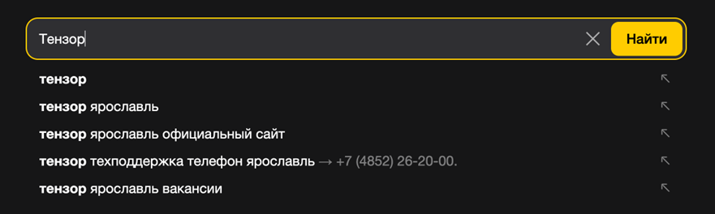
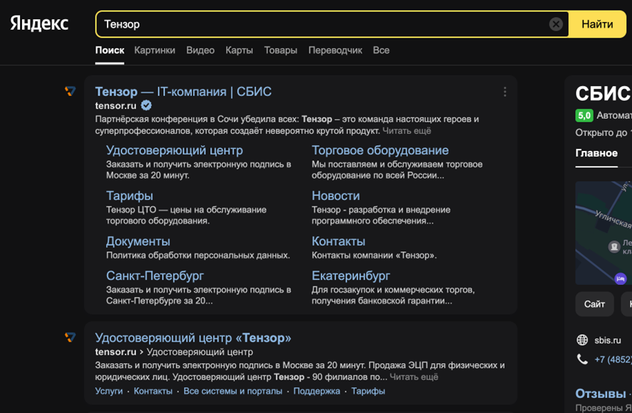

[](https://opensource.org/licenses/MIT)
# **Тестовое задание на позицию разработчика в тестировании.**

### Необходимо автоматизировать проверку следующих сценариев:

#### 1 Часть:
1)	Зайти на https://ya.ru/
2)	Проверить наличия поля поиска
3)	Ввести в поиск Тензор
4)	Проверить, что появилась таблица с подсказками (suggest) 

5)	Нажать enter
6)	Проверить, что появилась страница результатов поиска
7)	Проверить 1 ссылка ведет на сайт tensor.ru


### Правила выполнения задания:
1)	Автотесты реализованы на Python 3 и Selenium Webdriver
2)	В качестве тестового framework используется pytest
3)	Реализован паттерн PageObject
4)	Приветствуются любые сторонние библиотеки для логирования, отчетов, selenium wrapper
5)	Готовый проект залит на github / gitlab без кешей, драйверов и виртуальных окружений.


### **Стек:**
 


### **Дополнительные библиотеки:**


### **Запуск проекта в dev-режиме**
Инструкция ориентирована на операционную систему Windows и утилиту git bash.<br/>
##### Для прочих инструментов используйте аналоги команд для вашего окружения.

1. Клонируйте репозиторий и перейдите в него в командной строке:
```
git clone https://github.com/artyom-vah/test_tenzor.git
```

2. Установите и активируйте виртуальное окружение
```
python -m venv venv
```
```
source venv/Scripts/activate
```
или сразу так:
```
python -m venv venv && . venv/Scripts/activate
```
3. Обновите pip 
```
python -m pip install --upgrade pip
```
4. Установите зависимости из файла requirements.txt
```
pip install -r requirements.txt
```


