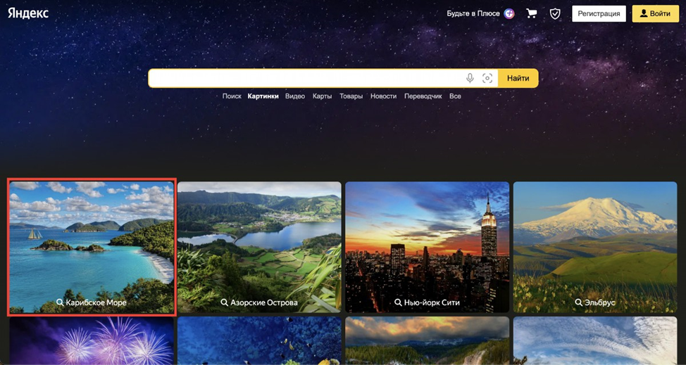
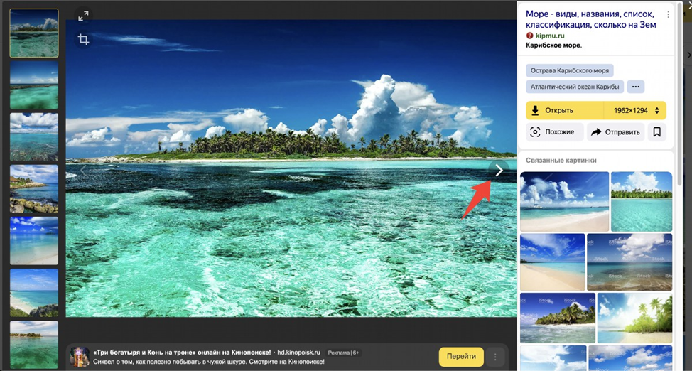

[](https://opensource.org/licenses/MIT)
# **Тестовое задание на позицию QA-разработчика в тестировании.**

### Необходимо автоматизировать проверку следующих сценариев:

#### 1й сценарий:
1)	Зайти на https://ya.ru/
2)	Проверить наличия поля поиска
3)	Ввести в поиск Тензор
4)	Проверить, что появилась таблица с подсказками (suggest)


5)	Нажать enter
6)	Проверить, что появилась страница результатов поиска
7)	Проверить 1 ссылка ведет на сайт tensor.ru


<br> <br>

#### 2й сценарий:
1)	Зайти на ya.ru
2)	Проверить, что кнопка меню присутствует на странице


<br>

3)	Открыть меню, выбрать “Картинки”


4)	Проверить, что перешли на url https://yandex.ru/images/
5)	Открыть первую категорию



<br>

6)	Проверить, что название категории отображается в поле поиска


<br>

7)	Открыть 1 картинку


<br>

8)	Проверить, что картинка открылась
9)	Нажать кнопку вперед



<br>

10.	Проверить, что картинка сменилась
11.	Нажать назад
12.	Проверить, что картинка осталась из шага 8

<br><br>

### Правила выполнения задания:
1)	Автотесты реализованы на Python 3 и Selenium Webdriver
2)	В качестве тестового framework используется pytest
3)	Реализован паттерн PageObject
4)	Приветствуются любые сторонние библиотеки для логирования, отчетов, selenium wrapper
5)	Готовый проект залит на github / gitlab без кешей, драйверов и виртуальных окружений.

<br>

### Описание паттерна Page Object:
Паттерн Page Object - помогает разделить логику тестов от логики взаимодействия (автоматизации) 
с элементами на страницах. Это делает тесты более модульными, понятными и поддерживаемыми.

В моем случае я реализовал данный паттерн таким способом:
```bash
- locators/
  |-- yandex_locators.py
- pages/
  |-- images_page.py
  |-- search_page.py
- tests/
  |-- conftest.py
  |-- test_images_yandex.py
  |-- test_search_yandex.py
 ```
- `locators/yandex_locators.py`: В этом файле определены локаторы элементов на странице.

- `pages/`: В данной папке находятся файлы `images_page.py` и `search_page.py`. Они содержат методы для выполнения операций на определенных страницах, таких как ввод текста в поле поиска, нажатие на кнопку и другие операции.

- `tests/`: В данной папке находятся файлы `conftest.py`, `test_images_yandex.py` и `test_search_yandex.py`.
    - `conftest.py`: Файл конфигурации pytest, где можно определить фикстуры и настройки, используемые в тестах.
    - `test_images_yandex.py` и `test_search_yandex.py`: Файлы, содержащие сами тесты. В них вы можете описывать проверки и использовать методы из классов `ImagesPage` и `SearchPage` для выполнения операций на соответствующих страницах.

<br>

### **Стек:**
 


### **Дополнительные библиотеки:**
 
[](https://pypi.org/project/pytest-html/3.2.0/)

### **Запуск проекта в dev-режиме**
Инструкция ориентирована на операционную систему Windows и утилиту git bash.<br/>
##### Для прочих инструментов используйте аналоги команд для вашего окружения.

1. Клонируйте репозиторий и перейдите в него в командной строке:
```bash
git clone https://github.com/artyom-vah/test_tenzor.git
```

2. Установите и активируйте виртуальное окружение
```bash
python -m venv venv
```
```bash
source venv/Scripts/activate
```
или сразу так:
```bash
python -m venv venv && . venv/Scripts/activate
```
3. Обновите pip 
```bash
python -m pip install --upgrade pip
```
4. Установите зависимости из файла requirements.txt
```bash
pip install -r requirements.txt
```
5. Запуск всех тестов с использованием pytest
```bash
python -m pytest
```
6. Запуск тестов 1го / 2го сценариев - Поиск в яндексе / Картинки на яндексе
```bash
python -m pytest tests/test_search_yandex.py
```
```bash
python -m pytest tests/test_images_yandex.py
```
```bash
# просто нажатием на зеленый треугольник или же комбинацией клавиш Shift+f10
```
7. Чтобы сгенерировать HTML-отчет
```bash
python -m pytest --html=report.html
```
```bash
# после чего будет сгенерирован файл report.html в корне проекта, 
# а также папка с файлом assets/style.css
```
<br>

**Пример готового отчета:**


Автор проекта: Артем Вахрушев.